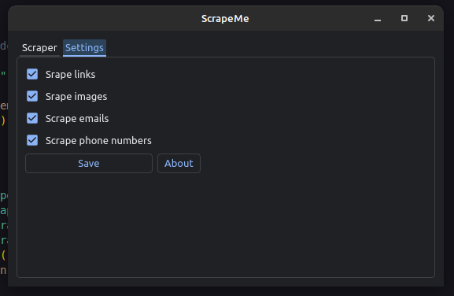

<h1  align="center">ScrapeMe</h1>

<p  align="center">

</p>

## About

A simple GUI application to scrape websites using BeautifulSoup4.

## Installation

Python 3.9 or above is recomended.

Install the necessary requirements via pip

```bash

pip install -r requirements.txt

```

Double click `ScrapeMe.py` or run via the command line.

## Screenshots



